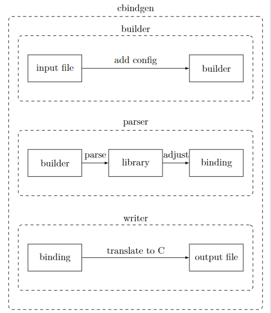
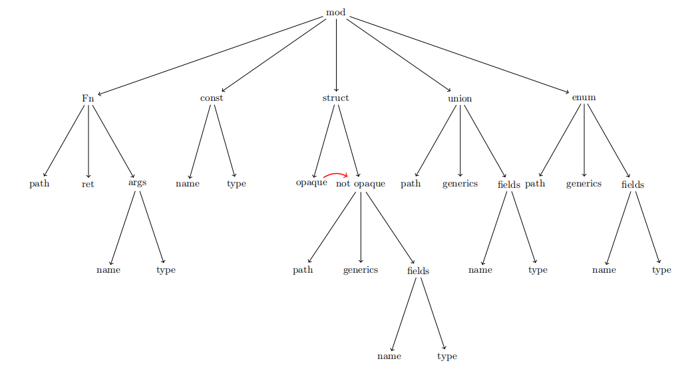
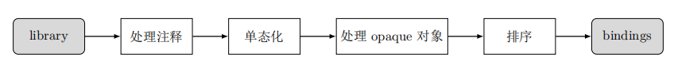

[TOC]

## 工作背景
​	在C和rust的跨语言交互中，由于rust的ABI不稳定，所以传递符合rust的ABI的结构体，枚举，联合等都是以裸指针的形式传递，不能够利用到rust对于结构体的安全性保障。所以我们提出了一个在rust 稳定ABI的前提下生成rust在C端的binding的工具，该工具生成的binding保证了在跨语言操作中，rust的结构体等数据结构会被完全的传递，进而利用到rust对于结构体的安全性保障。


## 已有工作分析
​	当前在C端生成rust的binding的主要工具是cbindgen，`cbindgen` 是一个高效且灵活的工具，可自动从 Rust 代码生成符合 C/C++ 接口规范的头文件，避免手动维护 `.h` 文件带来的同步错误。它支持结构体、枚举、外部函数等多种类型的导出，具有高度可配置性，能精确控制生成的头文件格式和内容，完美契合 Rust 的 FFI 用法。
​	但是，cbindgen对于binding的生成，是基于rust不稳定的ABI的前提条件（由于当前rust版本的快速迭代，编译器对结构体、枚举、联合等数据结构都会有各自的内存布局优化，所以现在rust的ABI并不稳定）。所以，cbindgen在FFI中传递结构体、枚举、联合等数据结构时，都是typedef一个新的结构体类型，然后传递它的指针。虽然这种方式简化了C端的使用，使其能够轻松访问Rust侧的数据，但同时也引入了一些潜在风险，如内存管理不匹配、引用计数失效、数据竞争以及Rus端与C端生命周期的不一致等问题。
​	现如今，很多研究者都开始对rust的stable ABI进行研究，如果rust稳定的ABI实现之后，内存布局不一致的问题将不复存在，这个时候传递裸指针的方式将只有缺点没有优点，所以我们提出了一个新的工具bindgen，他会对FFI传递的结构体等数据结构生成完整的成员细节，使得C端也能够按照rust的方式保证安全性。


## bindgen的工作流程

bindgen的大体工作流程如下图，主要分为三个阶段：
1. builder阶段：主要是配置相关信息。

2. parser阶段：parse部分解析文件，adjust部分进行一些处理。

3. writer阶段：把最后生成的binding按照C的形式输出。



接下来我会简单介绍这些过程：

<div STYLE="page-break-after: always;"></div>

### builder阶段
这个阶段主要起配置作用，读取config后，通过Builder模式的链式配置，构建builder对象。


``` rust 
    Builder::new()
        .with_config(config)
        .with_cargo(input)
        .generate()
```

#### 什么是Builder模式
Builder模式是一种创建型设计模式，它允许您逐步构建复杂对象。在Rust中，Builder模式通常与链式调用结合使用，提供了一种优雅且类型安全的方式来创建具有多个可选参数的结构体。

它们的new函数会创建一个什么都没有配置的对象：
```rust
    // 创建新的Builder
    pub fn new() -> Self {
        Self {
            name: None,
            age: None,
            email: None,
            phone: None,
        }
    }
```
它们的配置函数通常是返回self：
```rust
    // 设置姓名（必需）
    pub fn name<S: Into<String>>(mut self, name: S) -> Self {
        self.name = Some(name.into());
        self  // 返回self，支持链式调用

    }
```
然后最后优雅的链式调用完成对象的配置：
```rust
  let person1 = Person::builder()
        .name("张三")
        .age(25)
        .email("zhangsan@example.com")
        .phone("138-0000-0000")
        .build()
```

<div STYLE="page-break-after: always;"></div>

### parser阶段
在前面builder阶段，要被解析的文件被配置成了builder对象，接下来调用它的generate函数，构建library对象，这个过程大概可以描述为，通过嵌套解析整个文件，将解析的结果储存到一个parse数据结构中。parse_src是解析的主要逻辑，然后通过下面的调用链，调用到load_syn_crate_mod。

parse的过程：
```nginx
parse_src
   ↓
parse_mod
   ↓
process_mod
   ↓
load_syn_crate_mod
```

按照下图这个过程嵌套load，先从mod的方式进行解析，解析mod下一级的Fn，const，struct，union，enum等结构，然后再解析这些数据结构的下一级，然后完成整个文件的解析，让文件用AST语法节点表示。



最后把解析得到的结构体放入result中，然后用result构建library数据结构，进入下一个adjust阶段，对library进行相关逻辑的处理。

```rust
        let mut result = Parse::new();
        Library::new(
            self.config,
            result.constants,
            result.globals,
            result.enums,
            result.structs,
            result.unions,
            result.opaque_items,
            result.typedefs,
            result.functions,
            result.source_files,
            result.package_version,).generate()
```


### adjust阶段

对library进行处理流程大概是这样



得到的结果：

```rust
        Ok(Bindings::new(
            self.config,
            self.structs,
            self.typedefs,
            constants,
            globals,
            items,
            functions,
            self.source_files,
            false,
            self.package_version,
        ))
```
其中items是需要调整的数据结构，其他数据结构不需要处理直接传给binding。

<div STYLE="page-break-after: always;"></div>
## writer阶段

writer阶段采用了一种语言后端的模式，这个模式允许在运行时选择不同的代码生成策略（比如 C、C++、Cython 等）。通过实现共同的 [LanguageBackend](vscode-file://vscode-app/c:/Users/Administrator/AppData/Local/Programs/Microsoft%20VS%20Code/resources/app/out/vs/code/electron-sandbox/workbench/workbench.html) 接口，可以交换不同的语言后端而不改变主要逻辑。
```rust
pub struct CLikeLanguageBackend<'a> {
    config: &'a Config,
}
```

最后在write阶段通过定义好的函数把生成的binding转换成C语言。
```rust
Language::Cxx | Language::C => {
    self.write_with_backend(
        file,
        &mut CLikeLanguageBackend::new(&self.config),
    )
}
```

```rust
    fn write_struct<W: Write>(&mut self, out: &mut SourceWriter<W>, s: &Struct) {
        let condition = s.cfg.to_condition(self.config);
        condition.write_before(self.config, out);

        self.write_documentation(out, &s.documentation);

        if !s.is_enum_variant_body {
            self.write_generic_param(out, &s.generic_params);
        }

        // The following results in
        // C++ or C with Tag as style:
        //   struct Name {
        // C with Type only style:
        //   typedef struct {
        // C with Both as style:
        //   typedef struct Name {
        if self.generate_typedef() {
            out.write("typedef ");
        }

        out.write("struct");

        if let Some(align) = s.alignment {
            match align {
                ReprAlign::Packed => {
                    if let Some(ref anno) = self.config.layout.packed {
                        write!(out, " {}", anno);
                        println!("packed: {}", anno);

                    }
                }
                ReprAlign::Align(n) => {
                    if let Some(ref anno) = self.config.layout.aligned_n {
                        write!(out, " {}({})", anno, n);
                        println!("aligned_n: {}({})", anno, n);
                    }
                }
            }
        }

        if s.annotations.must_use(self.config) {
            if let Some(ref anno) = self.config.structure.must_use {
                write!(out, " {}", anno);
            }
        }

        if let Some(note) = s
            .annotations
            .deprecated_note(self.config, DeprecatedNoteKind::Struct)
        {
            write!(out, " {}", note);
        }

        if self.config.language != Language::C || self.config.style.generate_tag() {
            write!(out, " {}", s.export_name());
            println!("export_name: {}", s.export_name());
        }

        out.open_brace();

        // Emit the pre_body section, if relevant
        if let Some(body) = self.config.export.pre_body(&s.path) {
            out.write_raw_block(body);
            out.new_line();
        }

        out.write_vertical_source_list(self, &s.fields, ListType::Cap(";"), Self::write_field);

        if self.config.language == Language::Cxx {
            self.write_derived_cpp_ops(out, s);
        }

        // Emit the post_body section, if relevant
        if let Some(body) = self.config.export.post_body(&s.path) {
            out.new_line();
            out.write_raw_block(body);
        }

        if self.config.language == Language::Cxx
            && self.config.structure.associated_constants_in_body
            && self.config.constant.allow_static_const
        {
            for constant in &s.associated_constants {
                out.new_line();
                constant.write_declaration(self.config, self, out, s);
            }
        }

        if self.generate_typedef() {
            out.close_brace(false);
            write!(out, " {};", s.export_name());
        } else {
            out.close_brace(true);
        }

        for constant in &s.associated_constants {
            out.new_line();
            constant.write(self.config, self, out, Some(s));
        }

        condition.write_after(self.config, out);
    }
```


<div STYLE="page-break-after: always;"></div>

## opaque对象

接下来从opaque角度分析bindgen的工作流程：

opaque对象主要有两类：一类是不符合C的ABI的常规结构体，另一类是rust中的标准类型（如Arc等）。事实上，struct，union，enum，type都有opaque对象，本文主要以struct为例介绍opaque对象。
### opaque对象（struct类型的）
一些无法做结构体展开的对象会被存入opaque_items

在paser阶段load struct的过程中：
```rust
/// Loads a `struct` declaration.
fn load_syn_struct(
    &mut self,
    config: &Config,
    crate_name: &str,
    mod_cfg: Option<&Cfg>,
    item: &syn::ItemStruct,
) {
    match Struct::load(&config.layout, item, mod_cfg) {
        Ok(st) => {
            info!("Take {}::{}.", crate_name, &item.ident); 
            self.structs.try_insert(st);
        }
        Err(msg) => {
            info!(
                "Take {}::{} - opaque ({}).",
                crate_name,
                &item.ident,
                msg
            );
            let path = Path::new(item.ident.unraw().to_string());
            self.opaque_items.try_insert(
                OpaqueItem::load(path, &item.generics, &item.attrs, mod_cfg).unwrap(),
            );
        }
    }
}

```

凡是load不了的，都当成opaque对象处理。

struct的load逻辑：
```rust
    pub fn load(
        layout_config: &LayoutConfig,
        item: &syn::ItemStruct,
        mod_cfg: Option<&Cfg>,
    ) -> Result<Self, String> {
        let repr = Repr::load(&item.attrs)?;
        let is_transparent = match repr.style {
            ReprStyle::C => false,
            ReprStyle::Transparent => true,
            _ => {
                return Err("Struct is not marked #[repr(C)] or #[repr(transparent)].".to_owned());
            }
        };

        let path = Path::new(item.ident.unraw().to_string());

        // Ensure we can safely represent the struct given the configuration.
        if let Some(align) = repr.align {
            layout_config.ensure_safe_to_represent(&align)?;
        }

        let fields = match item.fields {
            syn::Fields::Unit => Vec::new(),
            syn::Fields::Named(ref fields) => fields
                .named
                .iter()
                .try_skip_map(|field| Field::load(field, &path))?,
            syn::Fields::Unnamed(ref fields) => {
                let mut out = Vec::new();
                let mut current = 0;
                for field in fields.unnamed.iter() {
                    if let Some(mut ty) = Type::load(&field.ty)? {
                        ty.replace_self_with(&path);
                        out.push(Field {
                            name: format!("{}", current),
                            ty,
                            cfg: Cfg::load(&field.attrs),
                            annotations: AnnotationSet::load(&field.attrs)?,
                            documentation: Documentation::load(&field.attrs),
                        });
                        current += 1;
                    }
                }
                out
            }
        };

        let has_tag_field = false;
        let is_enum_variant_body = false;

        Ok(Struct::new(
            path,
            GenericParams::load(&item.generics)?,
            fields,
            has_tag_field,
            is_enum_variant_body,
            repr.align,
            is_transparent,
            Cfg::append(mod_cfg, Cfg::load(&item.attrs)),
            AnnotationSet::load(&item.attrs)?,
            Documentation::load(&item.attrs),
        ))
    }
```
过程如下：
1. 解析属性，校验 `repr` 风格,只会处理#[repr(C)] or #[repr(transparent)]的结构体，其他都会返回错误。
   
2. 生成 path（struct 的name标记）。
   
3. 校验对齐方式。
   
4. 解析 struct 字段为内部格式。
   
5. 构造 Struct 返回。

因此opaque对象就是不能按照#[repr(C)] or #[repr(transparent)]方式布局的结构体。
### opaque对象（std type）
在parse阶段会添加基本的数据结构类型到opaque items里
```rust
        add_opaque("String", vec![]);
        add_opaque("Box", vec!["T"]);
        add_opaque("RefCell", vec!["T"]);
        add_opaque("Rc", vec!["T"]);
        add_opaque("Arc", vec!["T"]);
        add_opaque("Result", vec!["T", "E"]);
        add_opaque("Option", vec!["T"]);
        add_opaque("NonNull", vec!["T"]);
        add_opaque("Vec", vec!["T"]);
        add_opaque("HashMap", vec!["K", "V", "Hasher"]);
        add_opaque("BTreeMap", vec!["K", "V"]);
        add_opaque("HashSet", vec!["T"]);
        add_opaque("BTreeSet", vec!["T"]);
        add_opaque("LinkedList", vec!["T"]);
        add_opaque("VecDeque", vec!["T"]);
        add_opaque("ManuallyDrop", vec!["T"]);
        add_opaque("MaybeUninit", vec!["T"]);
```

在adjust阶段的单态化的过程中会对opaque对象进行处理。
instantiate_monomorphs函数：
```rust
fn instantiate_monomorphs(&mut self) {
    // 1. Collect a list of monomorphs
    let mut monomorphs = Monomorphs::default();

    // Add monomorphs from all items in the library
    self.structs.for_all_items(|x| {
        x.add_monomorphs(self, &mut monomorphs);
    });
    self.unions.for_all_items(|x| {
        x.add_monomorphs(self, &mut monomorphs);
    });
    self.enums.for_all_items(|x| {
        x.add_monomorphs(self, &mut monomorphs);
    });
    self.typedefs.for_all_items(|x| {
        x.add_monomorphs(self, &mut monomorphs);
    });
    for x in &self.functions {
        x.add_monomorphs(self, &mut monomorphs);
    }

    // 2. Insert the collected monomorphs into library's collections
    for monomorph in monomorphs.drain_structs() {
        self.structs.try_insert(monomorph);
    }
    for monomorph in monomorphs.drain_unions() {
        self.unions.try_insert(monomorph);
    }
    for monomorph in monomorphs.drain_opaques() {
        self.opaque_items.try_insert(monomorph);
    }
    for monomorph in monomorphs.drain_typedefs() {
        self.typedefs.try_insert(monomorph);
    }
    for monomorph in monomorphs.drain_enums() {
        self.enums.try_insert(monomorph);
    }

    // 3. Remove generic items that cannot be represented in C/C++
    self.opaque_items.filter(|x| x.is_generic());
    self.structs.filter(|x| x.is_generic());
    self.unions.filter(|x| x.is_generic());
    self.enums.filter(|x| x.is_generic());
    self.typedefs.filter(|x| x.is_generic());

    // 4. Mangle paths in remaining items to reflect their concrete types
    self.unions.for_all_items_mut(|x| x.mangle_paths(&monomorphs));
    self.structs.for_all_items_mut(|x| x.mangle_paths(&monomorphs));
    self.enums.for_all_items_mut(|x| x.mangle_paths(&monomorphs));
    self.typedefs.for_all_items_mut(|x| x.mangle_paths(&monomorphs));
    for x in &mut self.functions {
        x.mangle_paths(&monomorphs);
    }
}
```
1. 首先创建一个 [Monomorphs](vscode-file://vscode-app/c:/Users/Administrator/AppData/Local/Programs/Microsoft%20VS%20Code/resources/app/out/vs/code/electron-sandbox/workbench/workbench.html) 对象来收集所有单态化的类型
2. 然后遍历 Library 中的各种类型集合：
    - `structs` (结构体)
    - `unions` (联合体)
    - `enums` (枚举)

对于这些集合中的每个项目，调用 `add_monomorphs()` 方法来收集需要单态化的实例。
举个例子，对于Fn的args中的Arc，它对应的是type类型的add_monomorphs，在这个函数里对它单例化。

```rust
    fn instantiate_monomorph(
        &self,
        generic_values: &[GenericArgument],
        library: &Library,
        out: &mut Monomorphs,
    ) {
        assert!(self.is_generic(), "{} is not generic", self.path);
        // We can be instantiated with less generic params because of default
        // template parameters, or because of empty types that we remove during
        // parsing (`()`).
        assert!(
            self.generic_params.len() >= generic_values.len(),
            "{} has {} params but is being instantiated with {} values",
            self.path,
            self.generic_params.len(),
            generic_values.len(),
        );

        let mangled_path = mangle::mangle_path(
            &self.path,
            generic_values,
            &library.get_config().export.mangle,
        );

        let monomorph = OpaqueItem::new(
            mangled_path,
            GenericParams::default(),
            self.cfg.clone(),
            self.annotations.clone(),
            self.documentation.clone(),
        );

         out.insert_opaque(self, monomorph, generic_values.to_owned());
    }
```
这个函数会修改opaque对象的名字，清空泛型参数。
3. 将收集到的单态化类型插入到库的相应集合中
4. 移除任何仍然有泛型参数（未实例化）的item

单态化操作结束后，opaque items里只剩下binding中被实例化的标准类型，没有被实例化的都被移除了。
### opaque的命名方式
由于后续的结构体展开操作主要是根据opaque对象的命名来进行的，所以这里着重介绍opaque对象的命名方式。
opaque对象的命名方式参照下面的代码，由mangle_path得到一个修饰名。
```rust
pub fn mangle_path(path: &Path, generic_values: &[GenericArgument], config: &MangleConfig) -> Path {
    Path::new(mangle_name(path.name(), generic_values, config))
}
```
opaque对象的命名主要是由Mangler负责的。
```rust
struct Mangler<'a> {
    input: &'a str,
    generic_values: &'a [GenericArgument],
    output: String,
    last: bool,
    config: &'a MangleConfig,
}
```
它的成员函数来处理命名问题。
```rust
    fn mangle(mut self) -> String {
        self.mangle_internal();
        self.output
    }
```
mangle_internal按照顺序对结构体的名称，参数等调用push函数，将结果存入output中。
```rust
    fn mangle_internal(&mut self) {
        debug_assert!(self.output.is_empty());
        self.input.clone_into(&mut self.output);
        if self.generic_values.is_empty() {
            return;
        }

        self.push(Separator::OpeningAngleBracket);
        for (i, arg) in self.generic_values.iter().enumerate() {
            if i != 0 {
                self.push(Separator::Comma);
            }
            let last = self.last && i == self.generic_values.len() - 1;
            self.append_mangled_argument(arg, last);
        }

        // Skip writing the trailing '>' mangling when possible
        if !self.last {
            self.push(Separator::ClosingAngleBracket)
        }
    }
```
push函数负责把各种参数和成员元素添加进name中，根据分隔符的种类添加下划线的数量。
```rust
    fn push(&mut self, id: Separator) {
        let count = id as usize;
        let separator = if self.config.remove_underscores {
            ""
        } else {
            "_"
        };
        self.output.extend(std::iter::repeat(separator).take(count));
    }
```
分隔符主要是这些：
```rust
enum Separator {
    OpeningAngleBracket = 1,
    Comma,
    ClosingAngleBracket,
    BeginMutPtr,
    BeginConstPtr,
    BeginFn,
    BetweenFnArg,
    EndFn,
    BeginArray,
    BetweenArray,
}
```

下面针对opaque对象的命名举个例子：
```rust
    // Foo<f32> => Foo_f32
    assert_eq!(
        mangle_path(&Path::new("Foo"), &[float()], &MangleConfig::default()),
        Path::new("Foo_f32")
    );
```

最后将解析数据结构的结果，存入library
```rust
        Library::new(
            self.config,
            result.constants,
            result.globals,
            result.enums,
            result.structs,
            result.unions,
            result.opaque_items,
            result.typedefs,
            result.functions,
            result.source_files,
            result.package_version,
        )
        .generate()
```

### opaque的处理（我们的工作）
原来的cbindgen不会处理opaque对象，会直接输出，但是为了满足我们的需求，所以我们在这里对opaque对象进行处理，处理的总体思路是根据opaque对象的命名中包含的信息，对opaque对象进行还原，使它成为一个完整的数据结构，这个过程是在adjust阶段中处理opaque对象的阶段，处理过程如下：

在adjust阶段中，对于items中的opaque对象，我们需要做结构体展开，本文处理步骤如下：
1. 检查是否有需要处理的opaque对象，比如Arc
2. 解析名字，得到，这个结构体的类型和成员类型，比如Arc_i32是Arc结构体，成员类型是i32。 
3. 重新构造结构体放入items列表中：
```rust
	let struct_item = Struct::new(
		opaque.path.clone(),
		opaque.generic_params.clone(),
		fields, // 这里你可以指定默认字段
		false,  // has_tag_field
		false,  // is_enum_variant_body
		None,   // alignment
		false,  // is_transparent
		opaque.cfg.clone(),
		opaque.annotations.clone(),
		opaque.documentation.clone(),
	);
	ItemContainer::Struct(struct_item)
```
4.  构造这个结构体需要的结构体。
```rust
let arc_inner_struct = Struct::new(
    arc_inner_path,
    GenericParams::default(),
    vec![
        strong_field,
        weak_field,
        data_field,
    ],
    false,                  // has_tag_field
    false,                  // is_enum_variant_body
    None,                   // alignment
    false,                  // is_transparent
    None,                   // cfg
    Default::default(),     // annotations
    Documentation::none(),  // documentation
);

```
5. 添加这个结构体需要的头文件和函数头
```rust
        self.config.sys_includes.push("stdatomic.h".to_string());
```

如此items中的opaque对象就会完全展开为结构体。
<div STYLE="page-break-after: always;"></div>

## 结果展示

对于Arc：
现在使用经过改造后的bindgen处理下面的头文件：
```rust
use std::sync::Arc;
#[no_mangle]
pub extern "C" fn my_function(arc: Arc<i32>){}
```

之前得到的结果：
```C
#include <stdarg.h>
#include <stdbool.h>
#include <stdint.h>
#include <stdlib.h>

typedef struct Arc_i32 Arc_i32;

int32_t my_function(Arc_i32 *arc);
```

现在得到的结果：
```rust
#include <stdarg.h>
#include <stdbool.h>
#include <stdint.h>
#include <stdlib.h>
#include <stdatomic.h>

typedef struct {
    _Atomic size_t strong;
    _Atomic size_t weak;
    int32_t data;
} arc_inner;

typedef struct {
    arc_inner *value;
} Arc_i32;

```

对于Rc：
这是要处理的rust端的binding：
```rust
use std::sync::Rc;

#[no_mangle]
pub extern "C" fn my_function(rc: Rc<i32>){}
```

之前得到的结果：
```C
#include <stdarg.h>
#include <stdbool.h>
#include <stdint.h>
#include <stdlib.h>

typedef struct Rc_i32 Rc_i32;

void my_function(Rc_i32 rc);

```

现在得到的结果：
```rust
#include <stdarg.h>
#include <stdbool.h>
#include <stdint.h>
#include <stdlib.h>

typedef struct {
  uintptr_t value;
} unsafecell;

typedef struct {
  unsafecell value;
} cell;

typedef struct {
  cell strong;
  cell weak;
  int32_t data;
} rc_inner;

typedef struct {
  rc_inner *value;
} Rc_i32;

void my_function(Rc_i32 rc);


```

对于Box：
这是要处理的rust端的binding：
```rust
use std::sync::Rc;

#[no_mangle]
pub extern "C" fn my_function(rc: Rc<i32>){}
```

之前得到的结果：
```C
#include <stdarg.h>
#include <stdbool.h>
#include <stdint.h>
#include <stdlib.h>

typedef struct Box_i32 Box_i32;

void my_function(Box_i32 box_value);

```

现在得到的结果：
```rust
#include <stdarg.h>
#include <stdbool.h>
#include <stdint.h>
#include <stdlib.h>

typedef struct {
  int32_t *pointer;
} nonnull;

typedef struct {
  nonnull pointer;
} unique;

typedef struct {
  unique *value;
} Box_i32;

void my_function(Box_i32 box_value);


```

对于RefCell：
这是要处理的rust端的binding：
```rust
use std::sync::RefCell;

#[no_mangle]
pub extern "C" fn my_function(refcell: RefCell<i32>){}


```

之前得到的结果：
```C
#include <stdarg.h>
#include <stdbool.h>
#include <stdint.h>
#include <stdlib.h>

typedef struct RefCell_i32 RefCell_i32;

void my_function(RefCell_i32 refcell);

```

现在得到的结果：
```rust
#include <stdarg.h>
#include <stdbool.h>
#include <stdint.h>
#include <stdlib.h>

typedef struct {
  int32_t value;
} unsafecell;

typedef struct {
  intptr_t value;
} cell;

typedef struct {
  cell borrow;
  unsafecell value;
} RefCell_i32;

void my_function(RefCell_i32 refcell);


```


## 未来工作
现在已经支持的数据结构：

| 数据结构    |
| ------- |
| Arc     |
| Box     |
| Rc      |
| Refcell |
|         |


未来需要支持的数据结构：

| 数据结构     |
| ------------ |
| String       |
| Result       |
| Option       |
| NonNull      |
| Vec          |
| HashMap      |
| BTreeMap     |
| HashSet      |
| BTreeSet     |
| LinkedList   |
| VecDeque     |
| ManuallyDrop |
| MaybeUninit  |

- 常规的结构体
- 常规的枚举
- 常规的联合

未来还想根据对应的结构体，生成维护它们各自功能的函数。